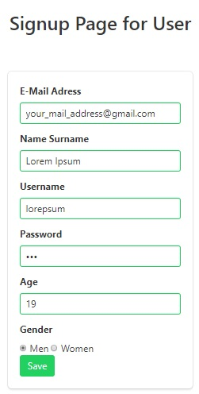

Parts Implemented by Ahmet Semih Uçan
=====================================

My Tables in Database
---------------------
People Table

=====  ========  ============   ======   ==============   ======   ======
id     username  name_surname	mail	 password_hash	  gender   age
=====  ========  ============   ======   ==============   ======   ======
5      berberr	 Hasan Berber   a@g.cm   Hash             m        21
=====  ========  ============   ======   ==============   ======   ======

Berber Table

===  =========  ========   ========   ========     ======  =======    ======
id   people_id  bshop_id   g_choice   exp_year     s_time  f_time     rates
===  =========  ========   ========   ========     ======  =======    ======
2    #4         #23        unisex     8            8       17         3
===  =========  ========   ========   ========     ======  =======    ======

Owner Table

=====  =========    =========   =============   ==========  =============== ========
id     people_id    tc_number   serial_number   vol_number  family_order_no order_no
=====  =========    =========   =============   ==========  =============== ========
4       #5          123134433   123             234         435             345
=====  =========    =========   =============   ==========  =============== ========

In this project assignment I was responsible for 3 tables. These tables were people, berber and owner tables. In people table, username and mail are unique so I wrote code by checking these rules.

Signup Flow
-----------

I've created a register type selection page to register a person to the website.
3 different types of records meet client on this page.
When the icons are over, the icon with js rotates and informs about the type of recording.
Clicking Continue button leads to the signup page. (By subject)

.. figure:: pictures/register_type.jpg
   :scale: 90 %
   :alt: map to buried treasure

   Register Type Page

According to the register type preference, I redirected the client to one of the pages in the image below. On this page I received information from the user in accordance with the type of user, barber and owner. I have written 3 different insert functions to add the incoming information to the tables. Username, mail and tc_number is unique so I checked this values for validation.

   Signup Page

Signin Flow
-----------
.. figure:: pictures/signin.jpg
   :scale: 90 %
   :alt: map to buried treasure

   Signin Page

In signin page, I get username and password from client. After this operation, I hash the password with passlib.hash library and check.

.. figure:: pictures/signin2.jpg
   :scale: 90 %
   :alt: map to buried treasure

   Signin Page Respond

- If written username and password is correct, "You have successfully logged in <TYPE>" message is shown.
- If written username and password is wrong, error message is shown.

Admin Panel
-----------
.. figure:: pictures/admin_panel.jpg
   :scale: 50 %
   :alt: map to buried treasure

   Admin Panel

Admin Panel Operations
----------------------
.. figure:: pictures/update.jpg
   :scale: 70 %
   :alt: map to buried treasure

    3 different update operation by person type for tables(people, berber, owner)

.. figure:: pictures/delete.jpg
   :scale: 70 %
   :alt: map to buried treasure

    3 different delete operation by person type for tables(people, berber, owner)

Navbar Edition
--------------
.. figure:: pictures/urls.jpg
   :scale: 100 %
   :alt: map to buried treasure

    Navbar links changing according to the type of person logging in

- If person doesn't login, navbar is shown like that first part of picture.
- If person login and person isn't admin, navbar is shown like that second part of picture.
- If person login and person is admin, Admin Panel url will be added to navbar and navbar is shown like that third part of picture.